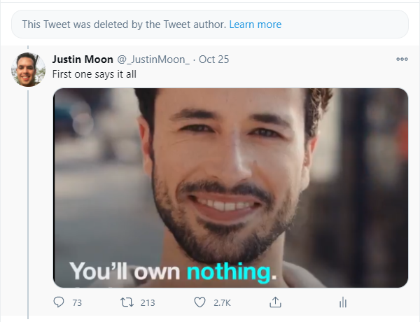
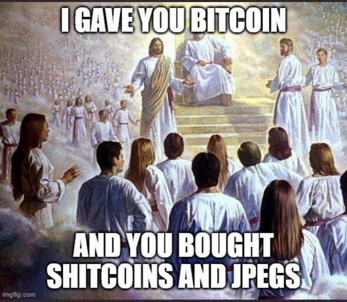

# Ordinal NFT Party

---

# [buddha.nft](nfts/buddha.nft)
- Ordinal: 1425808478041399
- Issuer: pubkey133rdsdr9ty662pe7ncznfeea89mrj559k7zatmevuep6hv2qh4hqk2lt6e


---

# [cypherperro.nft](nfts/cypherperro.nft)
- Ordinal: 1425808477891389
- Issuer: pubkey1yc20ykku7pnnxe6cvyzpvagtuhys8qmwwcz79acehvd3ek0rfunqesmk6f


---

# [joerodgers.nft](nfts/joerodgers.nft)
- Ordinal: 1715740163942679
- Issuer: pubkey1k2pg35p7e7cela42znvrk5z4nl8s99sx0ezk5haznt9rzm4xeynqfeself


---

# [purity.nft](nfts/purity.nft)
- Ordinal: 1425808478031389
- Issuer: pubkey1p65jx0hkcl005drxr74y5cpa9438s5e6murwca036v7mkdq0nzfsn68qfc

```
== What is the pure digital practice? ==

The pure digital practice removes impurities and confusion in digital realms.

The purpose of pure digital practice is to cleanse and nourish living souls.

== Why is digital purity desirable? ==

Anything that offers the ability to verify its purity is like God. The more
easily verifiable its purity, the more God-like it is.
```

---

# [ratio.nft](nfts/ratio.nft)
- Ordinal: 1425808478091389
- Issuer: pubkey1mqlg3p5naw7dk3w935wzcztqsp08xjckyw4lycf4wsz78j9ftyssqg60la


---

# [shitcoin.nft](nfts/shitcoin.nft)
- Ordinal: 1425808477901389
- Issuer: pubkey14dg8f49kzzqshqsjcf2lauanwpnud5kxu92uu9xkqdywsh27sguseelqst


---

# Today's Agenda
- Who am I?
- What are ordinals?
- What does that have to do with NFTs?
- Paper wallet ordinal NFT minting party w/free sats and wildly irresponsible
  private key management!

---

# Feel free to interrupt and ask questions!

---

# Who am I?
- I'm just this guy, you know?
- Bitcoin, Rust, and generative art programmer
- Last big project was Agora, a server for selling downloads for Lightning
  Network payments

---

# Why ordinals?
- Wanted a simple protocol for assets on Bitcoin
- Don't require any modification to the protocol
- Aesthetically appealing, so particularly well-suited for art

---

# What are ordinals?

---

# Ordinals are just serial numbers for satoshis

---

# They start at 0, and go up to 1,906,077,499,999,999 (so far!)

---

# Are transferred with a simple first-in-first-out algorithm

```
[2] [1] [3] → [4] [2]
```

```
[a b] [c] [d e f] → [? ? ? ?] [? ?]
```

```
[a b] [c] [d e f] → [a b c d] [e f]
```

---

# What about fees?

```
[2] [1] [3] → [4]
```

```
[a b] [c] [d e f] → [a b c d]
```

```
[SUBSIDY] [e f] → [SUBSIDY e f]
```

---

# Specification

```python
# subsidy of block at given height
def subsidy(height):
  return 50 * 100_000_000 >> height // 210_000

# first ordinal of subsidy of block at given height
def first_ordinal(height):
  start = 0
  for height in range(height):
    start += subsidy(height)
  return start

# assign ordinals in given block
def assign_ordinals(block):
  first = first_ordinal(block.height)
  last = first + subsidy(block.height)
  coinbase_ordinals = list(range(first, last))

  for transaction in block.transactions[1:]:
    ordinals = []
    for input in transaction.inputs:
      ordinals.extend(input.ordinals)

    for output in transaction.outputs:
      output.ordinals = ordinals[:output.value]
      del ordinals[:output.value]

    coinbase_ordinals.extend(ordinals)

  for output in block.transaction[0].outputs:
    output.ordinals = coinbase_ordinals[:output.value]
    del coinbase_ordinals[:output.value]
```

---

# What are ordinals good for?

If you want a token, you can just pick and ordinal to represent your token, and
use the location of the ordinal to represent ownership.

The person who controls the private key that corresponds to the public key of
the UTXO that contains the ordinal is the current owner of the token.

---

# What else are ordinals good for?

- Aesthetics!
- Supporting the fee market!

---

# Wacky aside: Ordinal traits

- 😏 Rare ordinals
- 🤤 Epic ordinals
- 🥵 Legendary ordinals
- Bounties: https://ordinals.com/bounties/

---

# Ordinal Index

- [big](http://api.ordinals.com:8000/list/e11d223685e110c5df93d7ae57f63c535ac59d1d65c16de779f23a9166229c7e:0)
- [small](http://api.ordinals.com:8000/list/81bb70199e0c2cf6a32ee0b8079085eb590c311f6e91bb51c14b85846593a76e:1)
- [spent](http://api.ordinals.com:8000/list/b40375d8e4f50728c18ed292c2e40ed616797592a2f5587c9f72a23a55973f9e:0)

---

# What are ordinals not good for?

- Not having to make weird multi-step transactions to avoid hitting the dust
  limit
- Being efficient with block space
- Very high divisibility
- Small databases

---

# Ordinal NFTs

1. Hash: (ordinal || content hash || public key)
2. Sign
3. Append signature, data, and then bech32 encode
4. Et voilà: `nft1qqz3psl8mvjm9t573n29l8q0phklcdhg65392pv0gpc79tydeujltn5g2h4fsg...`

---

# Ordinal NFTs

- No on-chain transaction to mint
- Store the NFT wherever
- Anyone who has access to the NFT will know the secret, hidden meaning of the
  ordinal.

---

# DISCLAIMER

[thicccc transaction](https://mempool.space/tx/c3a7786e164bbc7620a90601a1f284cff1a5e93c59978f566a9c7104bc33975a)

---

# NFT Minting Party!
1. Get a paper wallet with a PRIVATE_KEY
2. Pick a FILE to nft-ize (A meme? Some art? A poem?)
3. Pick an appealing ORDINAL on your paper wallet
4. Mint an nft and verify it:
    ```
    ord mint \
      --data-path FILE \
      --ordinal ORDINAL \
      --signing-key PRIVATE_KEY \
      --output-path output.nft

    ord verify --input-path output.nft
    ```
5. Send `output.nft` to casey@rodarmor.com or @rodarmor, if you want, so I can
   make a gallery!

## `ord` installation options:

1. Linux, MacOS, and Windows x86 binaries:
   `https://github.com/casey/ord/releases/tag/0.0.2`
2. `curl --proto '=https' --tlsv1.2 -sSf https://sh.rustup.rs | sh && cargo install ord`
3. Make me run it for you so you don't have to install weird code on your laptop

## Extra Credit for the Deranged Overachiever: Mint a Degenerate NFT

1. Go to: https://degenerate.computer
2. Read the inscrutable manual: https://degenerate.computer/man/
3. Input a program and execute it with `Shift + Enter`. for example:
    ```
    computer.resolution(4096);
    computer.scale(0.99);
    computer.circle();
    for (let i = 0; i < 100; i++) {
      computer.render();
    }
    computer.save();
    ```
4. Mint an NFT with the PNG
